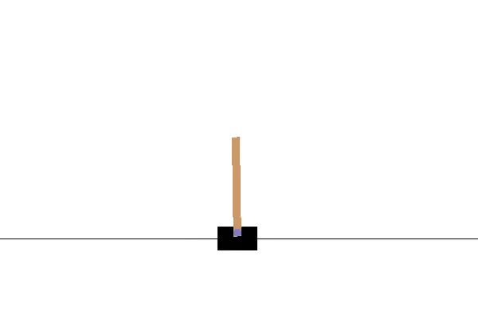

# Problem understanding
## Environment description
A pole is attached by an un-actuated joint to a cart, which moves along a frictionless track. The system is controlled by applying a force of +1 or -1 to the cart. The pendulum starts upright, and the goal is to prevent it from falling over. A reward of +1 is provided for every timestep that the pole remains upright. The episode ends when the pole is more than 15 degrees from vertical, or the cart moves more than 2.4 units from the center. More information can be founded <a href="https://arxiv.org/pdf/2012.07723.pdf"> here </a>. The figure below illustrates: </br>
<p align="center">

</p>

## Goal of the paper
<p> In this paper, we we used Deep Q-network (DQN) and Dueling DQN agent control to CartPole v1 sytem. The main Papers that we used are: <a href='https://arxiv.org/pdf/1312.5602.pdf' target="_blank">DQN </a> and <a href='https://arxiv.org/pdf/1511.06581.pdf' target="_blank">Dueling DQN </a> . </p>

<p> The problem is to prevent the vertical bar from falling by moving the car left or right (these represent the action space). To solve the problem <a href="https://arxiv.org/pdf/2012.07723.pdf"> CartPole v1 description </a>, the agent needs to receive an average total reward greater or equal to $475$ over $100$ consecutive episodes. As the figure below shows: </p>

[](https://colab.research.google.com/github/deepmind/dm_control/blob/master/tutorial.ipynb)
# Install the Project

```
$ git clone https://github.com/benjaminbenteke/Deep_RL_Project.git 
```

```
$ cd Deep_RL_Project
```
# Virtual environment

## Mac OS

### Create virtual environment 

```
$ python3 -m venv ENV_NAME
```
### Activate your environment 

```
$ source ENV_NAME/bin/activate
```

## Linux OS

### Create virtual environment 

```
$ conda create -n venv ENV_NAME
```

### Activate your environment 

```
$ activate ENV_NAME
```

# Requirement installations
To run this, make sure to install all the requirements by:

```
$ pip install -r requirements.txt 
```
# Running the model

```
$ python main.py --model MODEL_NAME
```
## Example of running models

```
$ python main.py --model dqn
```

```
$ python main.py --model dueling
```


# Results Presentation

``` DQN result: 500```  </br>
 

``` Dueling DQN result```  </br>



# Contributors #
<div style="display:flex;align-items:center">

<div style="display:flex;align-items:center">
    <div>
        <h5> <a href='https://github.com/benjaminbenteke'> Benjamn Benteke Longau </a> </h5> 
<div>
    <h5> <a href='https://github.com/Maramy93'> Maram A. Abdelrahman Mohamed </a> </h5> 
    
<div>
    <h5> <a href='https://github.com/Mikhael-P'> Mikhaël P. Kibinda-Moukengue </a> </h5> 
    
</div>

<div>
    <h5> <a href='https://github.com/ARNAUD-25'> Arnaud Watusadisi Mavakala </a> </h5> 
    
</div>

<div>
    <h5> <a href='https://github.com/Jeannette-del'> Jeanette Nyirahakizimana</a> </h5> 
</div>
</div>


